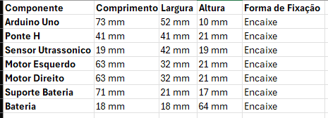
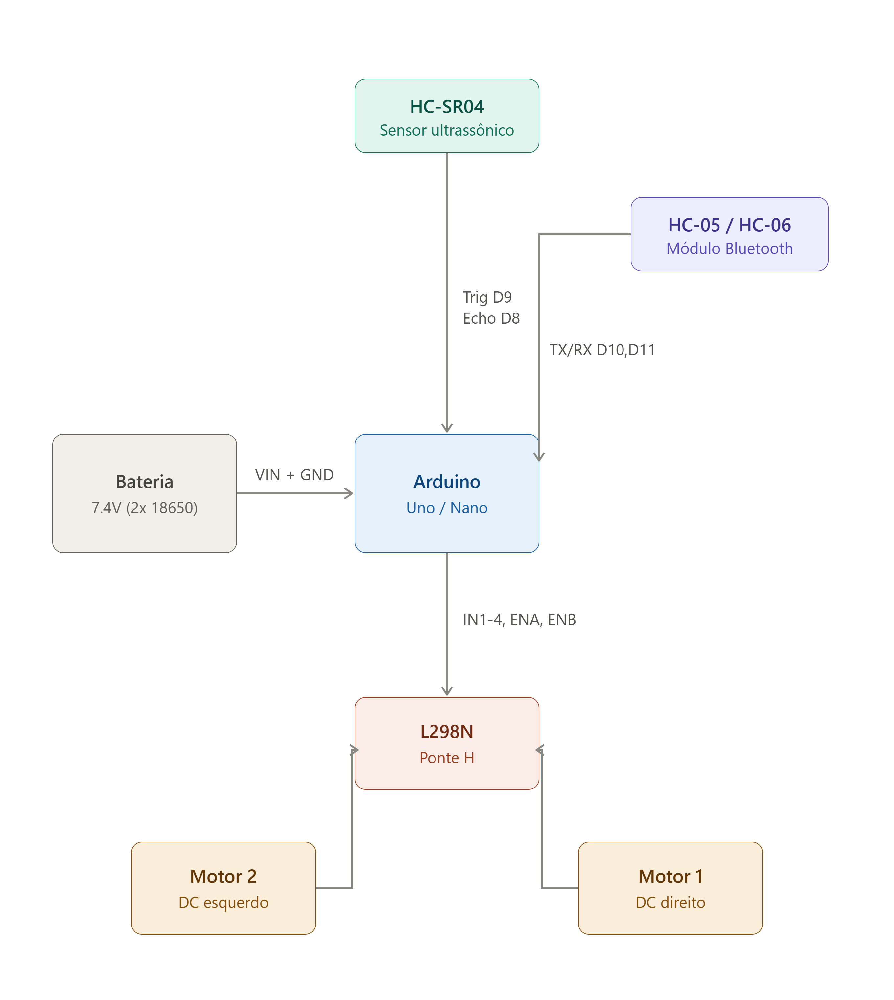
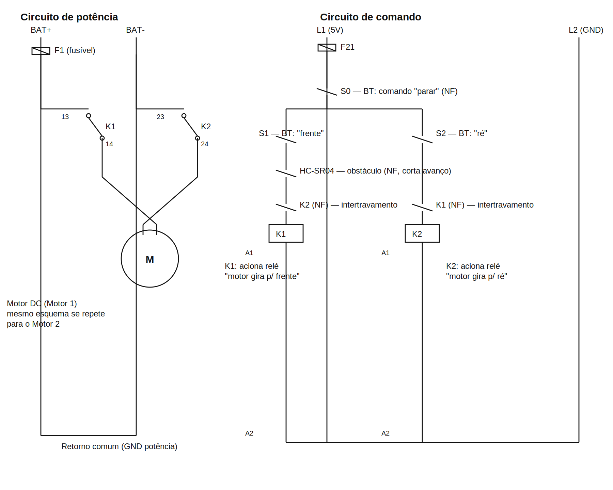
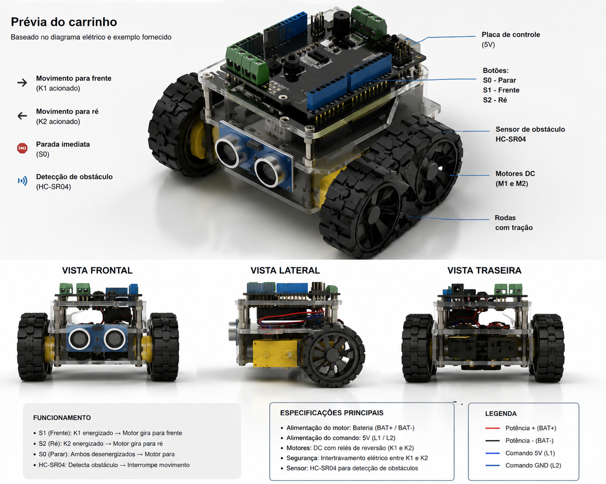

# 🤖 Robo

Projeto de desenvolvimento de um robô móvel com controle via Bluetooth, utilizando Arduino e componentes eletrônicos de fácil acesso.

---

## 📋 Visualização Geral



---

## 📊 Diagramas

### Diagrama de Blocos


### Diagrama Elétrico


### Prévia 3D (Renderização)


---

## 💰 Projeção de Custos

### Componentes e Valores

| Componente | Quantidade | Valor Unitário | Valor Total |
|-----------|-----------|-----------------|------------|
| Motores N20 500rpm | 2x | R$ 20,40 | R$ 40,80 |
| Arduino Uno R3 | 1x | R$ 100,07 | R$ 100,07 |
| Módulo Bluetooth | 1x | R$ 12,90 | R$ 12,90 |
| Ponte L293D | 1x | R$ 11,90 | R$ 11,90 |
| Cabos | - | - | R$ 5,00 |
| Filamento (150g) | - | - | R$ 10,00 |
| **TOTAL** | - | - | **R$ 180,67** |

---

## 🛠️ Componentes Utilizados

- **2x Motores N20 500rpm**: Responsáveis pela propulsão do robô
- **Arduino Uno R3**: Microcontrolador responsável pela lógica de controle
- **Módulo Bluetooth**: Permite comunicação sem fio com o robô
- **Ponte L293D**: Driver de motor para controle de direção e velocidade
- **Cabos e conectores**: Interconexão dos componentes
- **Filamento (150g)**: Material para impressão 3D de peças estruturais

---

## 👥 Integrantes do Projeto

| Nome | RM | Papel |
|------|----|----|
| 🍙 Fernanda Kaory Saito | RM551104 | |
| ⚡ João Pedro Borsato Cruz | RM550294 | |
| 💫 Maria Fernanda Vieira de Camargo | RM97956 | |
| 🚀 Pedro Lucas de Andrade Nunes | RM550366 | |
| 💥 Sofia Amorim Coutinho  | RM552534 | |

---

## 📁 Estrutura do Projeto

```
Robo/
├── README.md
├── img/
│   ├── tabela.png
│   ├── diagrama-blocos.png
│   ├── diagrama-eletrico.png
│   └── previa.png
└── organizacao/
    ├── MVP.pdf
    ├── MoSCoW.pdf
    ├── Kanban.md
    └── Backlog.md
```

---

## 🔧 Próximas Etapas

- [ ] Montagem dos componentes
- [ ] Programação do firmware Arduino
- [ ] Testes de comunicação Bluetooth
- [ ] Calibração dos motores
- [ ] Testes de mobilidade

---

