# 🤖 Carrinho-Robô SMARS — Bluetooth + desvio de obstáculos

**Project-based Maker Lab · Check Point 1 · FIAP**

| Integrante | RM |
|---|---|
| Fernanda Kaory Saito | RM551104 |
| João Pedro Borsato Cruz | RM550294 |
| Maria Fernanda Vieira de Camargo | RM97956 |
| Pedro Lucas de Andrade Nunes | RM550366 |
| Sofia Amorim Coutinho | RM552534 |

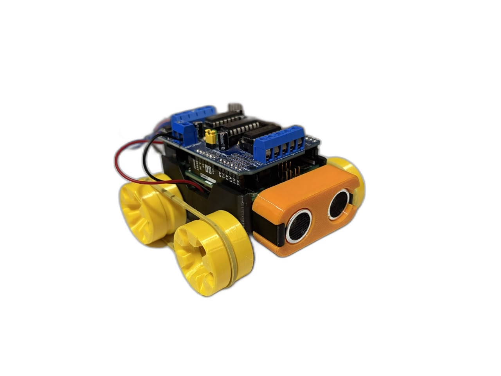

🎬 **Vídeo de funcionamento (controle remoto + sensor + modo autônomo):** https://youtu.be/DnCW8VLloSI

---

## Sumário

1. [Objetivo e descrição](#1-objetivo-e-descrição)
2. [Principais funcionalidades](#2-principais-funcionalidades)
3. [Organização do repositório](#3-organização-do-repositório)
4. [Linha do tempo do projeto](#4-linha-do-tempo-do-projeto)
5. [Requisitos, planejamento e evolução](#5-requisitos-planejamento-e-evolução)
6. [Projeto mecânico e fabricação](#6-projeto-mecânico-e-fabricação)
7. [Hardware e eletrônica](#7-hardware-e-eletrônica)
8. [Software](#8-software)
9. [Testes e resultados](#9-testes-e-resultados)
10. [Evidências finais e instruções de uso](#10-evidências-finais-e-instruções-de-uso)
11. [Custos](#11-custos)
12. [Créditos e licença](#12-créditos-e-licença)

---

## 1. Objetivo e descrição

Desenvolver um carrinho-robô funcional integrando projeto mecânico, fabricação digital, eletrônica,
programação e documentação. O robô é controlado pelo celular via **Bluetooth**, possui um **sensor
ultrassônico** que impede colisões e um **modo autônomo** em que anda sozinho desviando de obstáculos.

A estrutura é impressa em 3D a partir do projeto open-source **SMARS**, montada e adaptada pela equipe:
a proposta original com esteiras foi descartada após os testes e as **rodas foram redesenhadas** pela
equipe em quatro iterações até chegar a uma versão com canal para elástico, que resolveu a tração.

| | |
|---|---|
| **Microcontrolador** | Arduino Uno R3 |
| **Ponte H** | Shield L293D (empilhado no Uno) |
| **Motores** | 2× N20 com redução, 6 V, 500 rpm |
| **Sensor** | HC-SR04 (ultrassônico), na capa frontal |
| **Comunicação** | HC-05 (Bluetooth SPP) + app *Arduino Bluetooth RC Car* |
| **Alimentação** | Bateria 9 V no compartimento do chassi |
| **Estrutura** | Chassi SMARS impresso em PLA · rodas redesenhadas pela equipe |

---

## 2. Principais funcionalidades

- **Controle remoto Bluetooth**: frente, ré, esquerda, direita, diagonais, parar e **velocidade** pelo slider do app.
- **Segurança por sensor**: no modo manual, um obstáculo a menos de 20 cm **bloqueia o avanço** (ré e giros continuam liberados); liberou o caminho, o avanço volta.
- **Modo autônomo** (botão `X` do app): anda sozinho, desacelera ao se aproximar de obstáculos e, ao encontrar um, dá ré e **gira até o sensor ver caminho livre**; se ficar preso, faz manobra de fuga.
- **Leitura robusta do ultrassônico**: timeout, mediana de 3 leituras e tratamento de "sem eco".
- **Tração diferencial** com rodas motoras 1 mm maiores que as livres (contato garantido) e elástico na banda de rodagem.
- **Telemetria** pela USB (distância, modo, comandos) para depuração e calibração.

---

## 3. Organização do repositório

```
Robo/
├── README.md                      ← este documento
├── cad/
│   ├── README.md                  ← origem do chassi, evolução das rodas, como regenerar
│   ├── stl/robo_arduino.3mf       ← projeto de fatiamento completo (9 placas, Sovol SV07)
│   ├── stl/rodas/*.stl            ← rodas v1 (lisa), v2 (ranhurada) e v4 (canal p/ elástico — final)
│   └── scripts/                   ← remodel.js (gera as rodas), manifold_check.js, stl_render.js
├── hardware/
│   ├── conexoes.md                ← pinagem final, diagrama e alimentação
│   └── diagrama-componentes.*     ← diagrama da arquitetura PLANEJADA (L298N), mantido como histórico
├── software/
│   ├── smars_completo/            ← FIRMWARE FINAL: Bluetooth + segurança + modo autônomo
│   ├── smars_bluetooth/           ← só controle Bluetooth (didático)
│   ├── smars_desvio/              ← só desvio autônomo (didático)
│   └── historico/                 ← versões iniciais (v1) mantidas como registro
├── organizacao/                   ← MVP, MoSCoW, Backlog, Kanban (planejamento das aulas)
└── img/
    ├── carrinho-final.jpg · componentes.jpg · chassi-interno.jpg
    ├── previa.png · diagrama-blocos.png · diagrama-eletrico.png · tabela.png   (proposta inicial)
    ├── fabricacao/placa-1..9.png  ← placas de impressão
    └── rodas/                     ← renders de cada versão das rodas
```

---

## 4. Linha do tempo do projeto

| Data | Etapa | Evidência |
|---|---|---|
| **13/08** | Kickoff: repositório criado, definição dos requisitos, levantamento e medição dos componentes | commits `49098f2`, `54a73b1`; [img/tabela.png](img/tabela.png) |
| **18/08** | Proposta inicial: diagrama de blocos, diagrama elétrico (comando/potência) e prévia 3D do carrinho. Arquitetura planejada: Uno + L298N + 2× N20 + HC-SR04 + HC-05 + 7,4 V | commit `8a23aa2`; [previa](img/previa.png), [blocos](img/diagrama-blocos.png), [elétrico](img/diagrama-eletrico.png) |
| **27/08** | Planejamento: MVP, MoSCoW, backlog com 38 tarefas e kanban; projeção de custos | PR #1 `tarefa17-mvp`, commit `2977194`; [organizacao/](organizacao/) |
| **01/09** | Fabricação digital: escolha do chassi SMARS, fatiamento em 9 placas (Bambu Studio, perfil Sovol SV07); diagrama de componentes | commit `f2c2535`; [cad/stl/robo_arduino.3mf](cad/stl/robo_arduino.3mf), [img/fabricacao/](img/fabricacao/) |
| **01/09 – início de set.** | Impressão de todas as peças e montagem. **Decisões**: shield L293D no lugar da L298N; bateria 9 V no lugar de 7,4 V (compartimento do chassi) | [img/componentes.jpg](img/componentes.jpg), [img/chassi-interno.jpg](img/chassi-interno.jpg) |
| **11/09** | Primeiro teste de locomoção com **esteiras**: laço curto demais, a esteira pressionava as rodas e **travava o motor**. Tentativas: compensação XY dos furos no fatiador (0,065 → 0,115 mm), esticar cada elo 1,4 % (16 elos), lixar e lubrificar as juntas. Sem sucesso → **esteiras descartadas** | seção [Testes](#9-testes-e-resultados) |
| **15/09** | **Rodas v1 (lisas Ø32)** geradas por script a partir da roda original: dentes de engate removidos, encaixes internos preservados. **v2 ranhurada** (24 sulcos) para tração | [cad/README.md](cad/README.md), [img/rodas/](img/rodas/) |
| **16/09** | Problema: rodas motoras **girando em falso** (mesmo diâmetro das livres → perdiam contato). **v3**: motoras Ø33, livres Ø32 | `cad/stl/rodas/roda_motor_*.stl` |
| **17/09** | **v4 – canal para elástico** com parede em rampa de 45° (imprime sem suporte). Elástico nas motoras: **tração resolvida** ✅ | [img/rodas/v4-canal-render.png](img/rodas/v4-canal-render.png) |
| **17/09** | Firmware: desvio v1 → v2 (filtro, escaneio) → **v3** (gira até ver livre, fuga); Bluetooth v2 (velocidade, diagonais); **firmware unificado** com modo manual seguro + autônomo | [software/](software/) |
| **17/09** | Documentação final desta versão do repositório | este README |

---

## 5. Requisitos, planejamento e evolução

### 5.1 Requisitos (MVP)

Definidos em [organizacao/MVP.pdf](organizacao/MVP.pdf) e priorizados em [organizacao/MoSCoW .pdf](organizacao/MoSCoW%20.pdf):

| Requisito | Critério de aceite | Status |
|---|---|---|
| Arduino operacional | programa carregado e executando | ✅ |
| Ponte H controla os dois motores | frente, ré e curvas | ✅ (shield L293D) |
| Frente / ré / esquerda / direita / parar | movimentos executados pelo robô | ✅ |
| Bluetooth | celular envia comandos ao Arduino | ✅ |
| HC-SR04 mede distância | leitura correta em cm | ✅ (com filtro) |
| Segurança: obstáculo tem prioridade sobre o avanço | robô impede o avanço | ✅ |
| Alimentação por bateria | opera sem USB | ✅ (9 V) |
| *Should*: velocidade por PWM, distância configurável | slider do app; constantes no código | ✅ |
| *Could*: modo automático com desvio de obstáculos | robô navega sozinho | ✅ |
| *Should*: tratamento de perda do Bluetooth | estado seguro ao perder conexão | ⏳ backlog |

### 5.2 Proposta inicial e esboços

| Prévia 3D (18/08) | Diagrama de blocos planejado |
|---|---|
|  |  |

Diagrama elétrico da lógica de comando/potência (18/08): [img/diagrama-eletrico.png](img/diagrama-eletrico.png).
Dimensões medidas dos componentes para o projeto do chassi (13/08): [img/tabela.png](img/tabela.png).

### 5.3 Planejamento

- **MVP** — [organizacao/MVP.pdf](organizacao/MVP.pdf): quando o robô é "minimamente funcional" e quando está concluído.
- **MoSCoW** — [organizacao/MoSCoW .pdf](organizacao/MoSCoW%20.pdf): must / should / could / won't.
- **Backlog** — [organizacao/Backlog.md](organizacao/Backlog.md): 38 tarefas com responsável, dependência e critério de aceite.
- **Kanban** — [organizacao/Kanban.md](organizacao/Kanban.md): colunas, limites de WIP e sprints.

### 5.4 Decisões de projeto (planejado × construído)

| Item | Planejado (ago.) | Construído (set.) | Por quê |
|---|---|---|---|
| Ponte H | L298N avulsa, 6 fios de controle | **Shield L293D** empilhado no Uno | Encaixa direto no Uno e no chassi SMARS, elimina jumpers de controle, mais barato (R$ 11,90) |
| Alimentação | 2× 18650 (7,4 V) | **Bateria 9 V alcalina** | O chassi SMARS tem compartimento para 9 V; dispensa carregador/BMS; os 9 V compensam a queda de ~1,5 V do L293D |
| Locomoção | 2 rodas motoras + roda boba | **4 rodas: 2 motoras + 2 livres**, sem esteira | Esteira do SMARS travava o motor; rodas com elástico deram tração e permitem girar no lugar |
| Rodas | rodas do SMARS com dentes de esteira | **Rodas redesenhadas** (v4: lisas, Ø33/Ø32, canal p/ elástico) | Ver [linha do tempo](#4-linha-do-tempo-do-projeto) e [cad/README.md](cad/README.md) |
| Pinos do HC-SR04 | D8 / D9 | **A0 / A1** | D8 e D9 são usados pelo shield |
| Pinos do HC-05 | D10 / D11 | **D9 / D10** (conectores de servo do shield) | D11 é o PWM do motor M1 no shield |
| Sensor no software | só parada por obstáculo | Parada **+ desvio autônomo + fuga quando preso** | Evolução de item *could have* do MoSCoW |

### 5.5 Status final do backlog

| Tarefas | Status |
|---|---|
| T01–T10 componentes, layout, base, fixações | ✅ concluídas (chassi SMARS impresso; suportes de motor, bateria e sensor) |
| T11–T13 alimentação e ligação dos motores | ✅ (bateria 9 V → shield; motores em M1/M2) |
| T14–T20 testes dos motores e funções de movimento | ✅ |
| T21–T23 sensor conectado, leitura, parada por obstáculo | ✅ |
| T24–T26 Bluetooth e mapeamento de comandos | ✅ |
| T27 fail-safe de perda do Bluetooth | ⏳ não implementado |
| T28 calibração da distância | ✅ (constantes `DIST_PARAR`, `DIST_REDUZIR`, `DIST_LIVRE`) |
| T29–T30 movimentação integrada e detecção em movimento | ✅ |
| T31 organização dos cabos | 🔶 parcial |
| T32 autonomia da bateria | ⏳ não medida formalmente |
| T33–T34 percurso completo e correção de bugs | ✅ (ver [Testes](#9-testes-e-resultados)) |
| T35–T37 documentação de circuito, software e montagem | ✅ |
| T38 demonstração | 🎬 vídeo — link no topo |

---

## 6. Projeto mecânico e fabricação

### 6.1 Chassi

O chassi é o **SMARS** (Screwless Modular Assemblable Robotic System, de Kevin Thomas — projeto open-source
publicado no Thingiverse sob licença Creative Commons). Foi escolhido em 01/09 porque já prevê exatamente os
componentes do nosso planejamento: berços para motores N20, compartimento para bateria 9 V, encaixe do Arduino
Uno com shield e capa frontal para o HC-SR04. Toda a fabricação (fatiamento, impressão, pós-processamento e
montagem) foi feita pela equipe; a **adaptação mecânica** foi o redesenho completo das rodas.

**Fatiamento** — Bambu Studio 2.3, perfil Sovol SV07, bico 0,4 mm, camada 0,2 mm, PLA. Projeto completo em
[cad/stl/robo_arduino.3mf](cad/stl/robo_arduino.3mf), organizado em 9 placas:

| Placa 1 – esteiras | Placa 2 – chassi | Placa 3 – rodas originais |
|---|---|---|
| 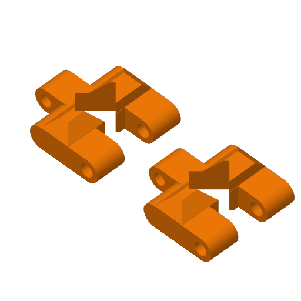 | 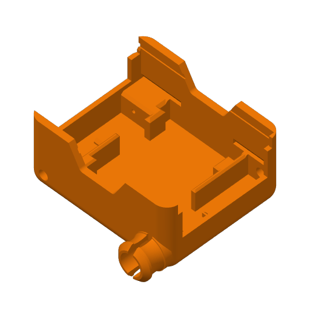 | 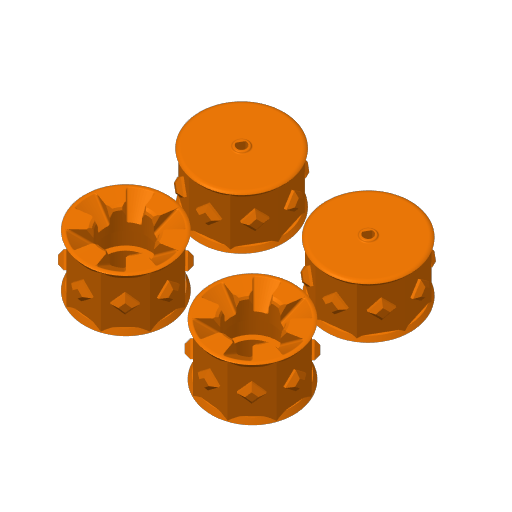 |
| **Placa 4 – suporte bateria 9 V** | **Placa 5 – suporte sensor IR (opcional)** | **Placa 6 – conector (opcional)** |
| 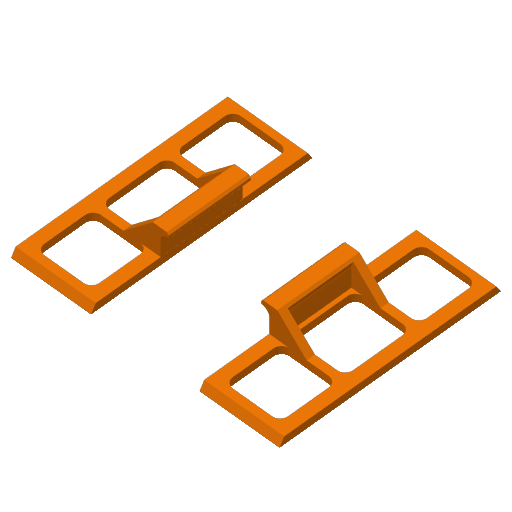 | 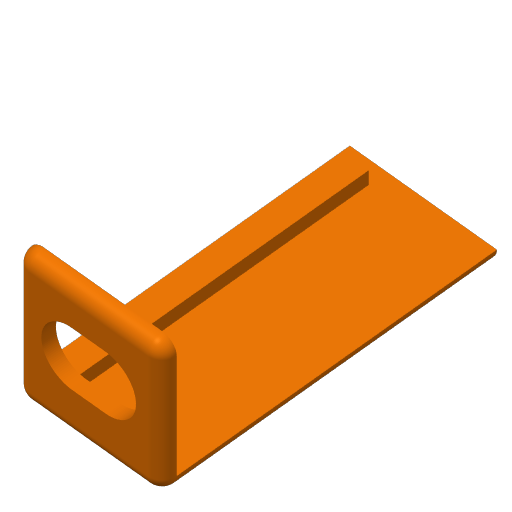 | 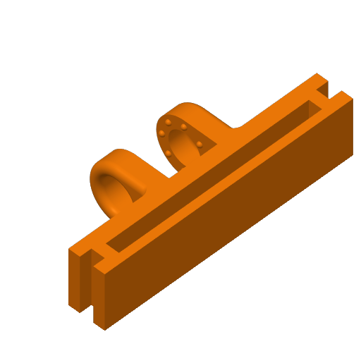 |
| **Placa 7 – capa HC-SR04 (base)** | **Placa 8 – capa HC-SR04 (a)** | **Placa 9 – capa HC-SR04 (b)** |
| 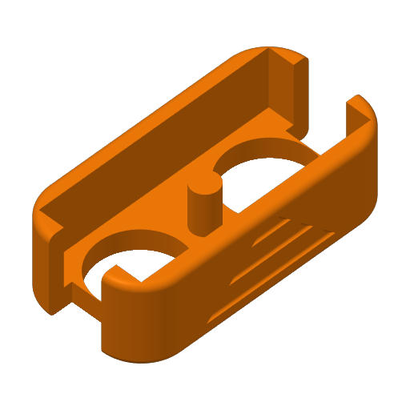 | 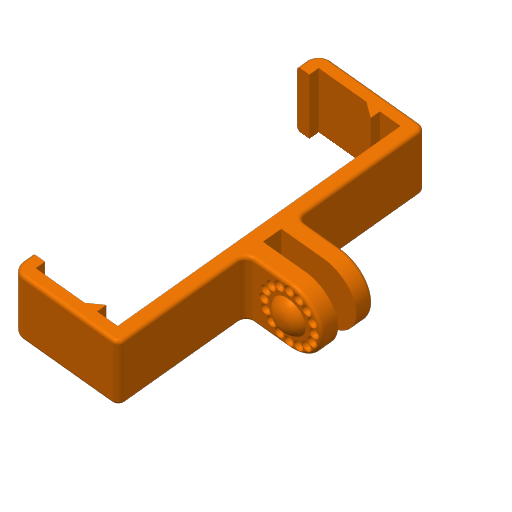 | 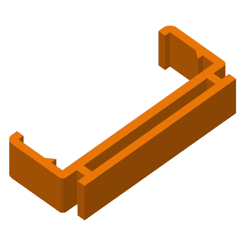 |

| Peças impressas antes da montagem | Chassi montado por baixo (motores N20 nos berços, bateria 9 V) |
|---|---|
| 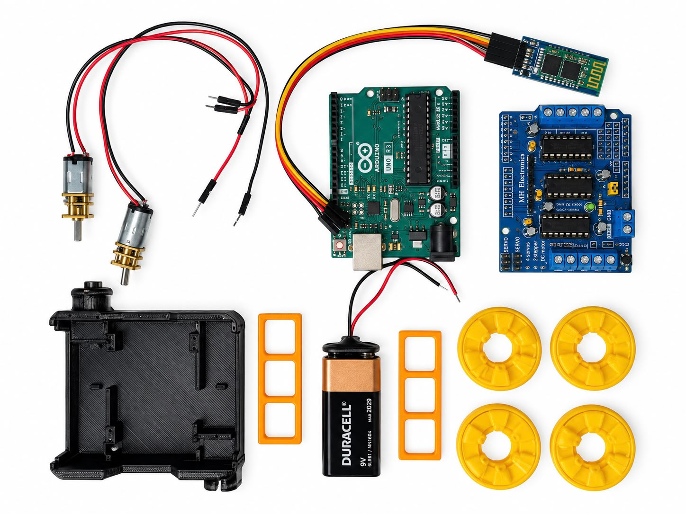 | 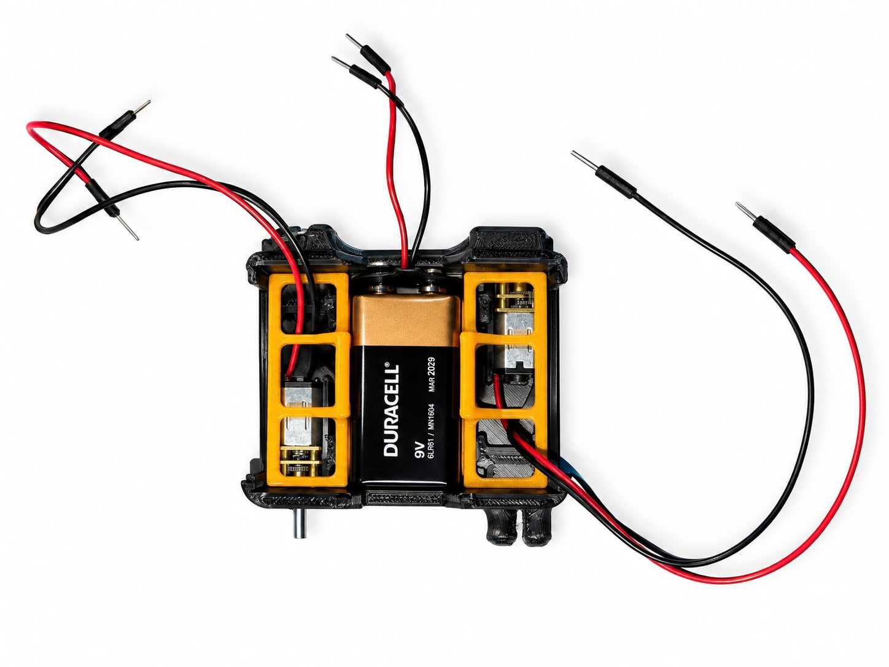 |

### 6.2 Rodas — quatro iterações

A roda original do SMARS tem 8 dentes piramidais que engatam nos losangos da esteira. Como a esteira foi
descartada, as rodas foram **regeneradas por script** ([cad/scripts/remodel.js](cad/scripts/remodel.js)) a
partir do STL original: a superfície externa é reconstruída (lisa, ranhurada ou com canal) enquanto o
**encaixe interno** (furo D do motor N20, cavidade de 6 lóbulos, furo passante da roda livre) é preservado.
Cada STL foi validado por um verificador de malha (0 arestas abertas, 0 não-manifold) antes de imprimir.

| v0 – original (dentes p/ esteira) | v1 – lisa Ø32 | v2 – ranhurada |
|---|---|---|
| 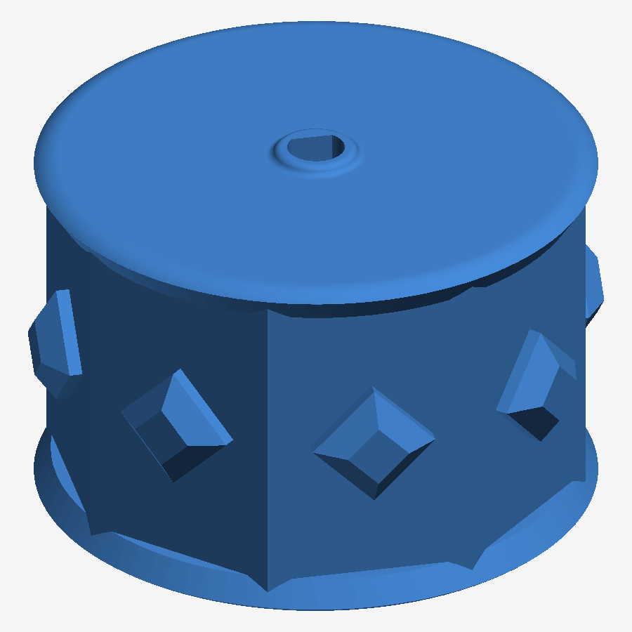 | 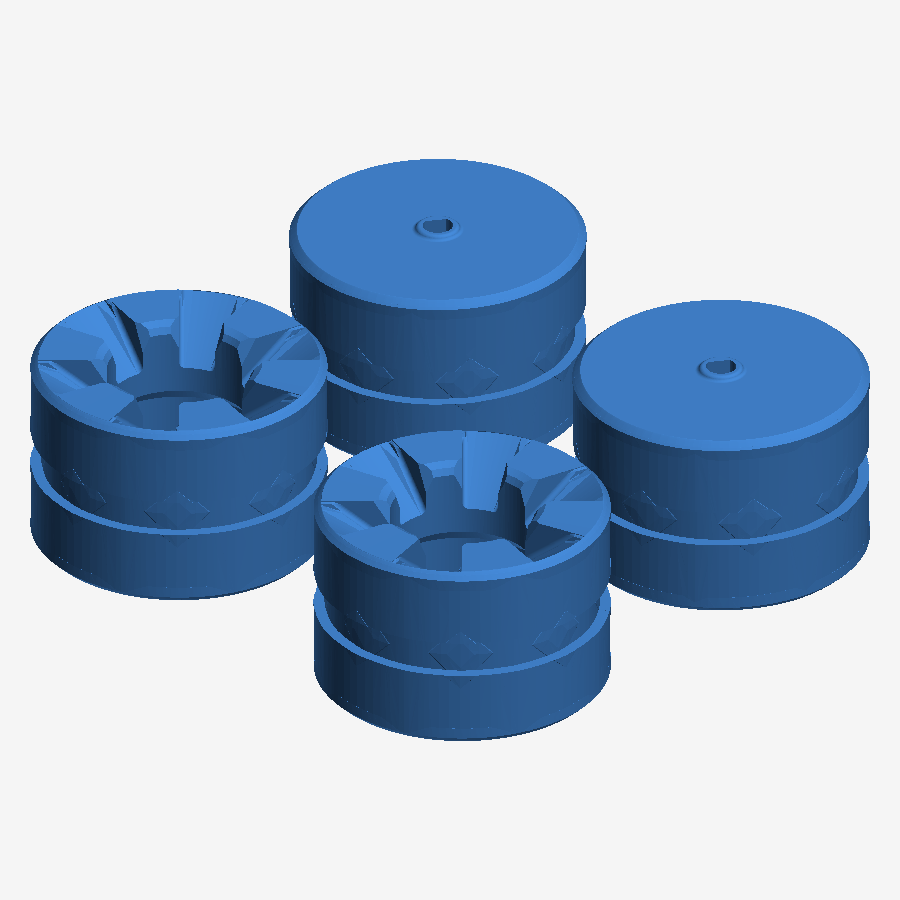 | 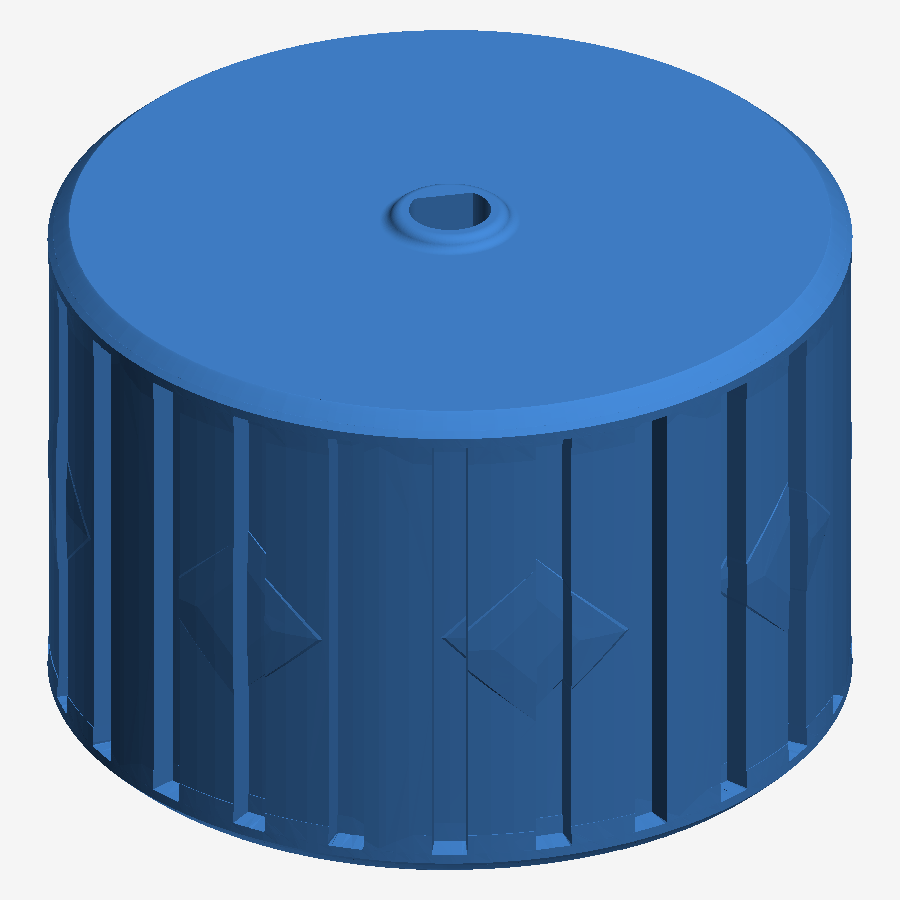 |
| **Elo da esteira descartada** | **v4 – canal para elástico (final)** | **v4 – perfil do canal** |
| 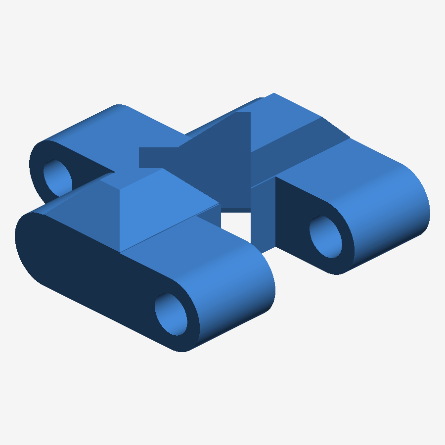 | 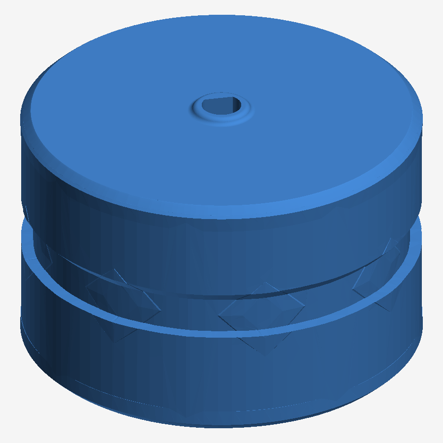 | 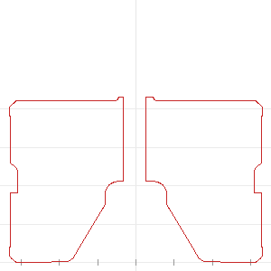 |

Decisões de detalhe da v4:
- **Motora Ø33 × livre Ø32**: com 4 rodas rígidas, diâmetros iguais deixam uma roda no ar (como mesa de 4 pés). A motora 0,5 mm mais alta garante que o carrinho sempre apoie nas rodas de tração.
- **Canal** com fundo plano de 3 mm, 1 mm de profundidade, parede inferior reta e **parede superior em rampa de 45°**: imprime deitado sem suporte.
- **Elástico só nas motoras**: as rodas livres precisam deslizar de lado para o carrinho girar no lugar.
- Chanfros de 0,8 mm nas bordas; residual dos dentes reduzido a < 0,1 mm (abaixo da resolução do bico).

Tabela completa das versões, arquivos e como regenerar: [cad/README.md](cad/README.md).

### 6.3 Carenagem e acabamento

- **Capa frontal do sensor** (peças `ultrasonic_1`, `ultrasonic_2a`, `ultrasonic_2b` — placas 7 a 9), impressa em laranja: protege e posiciona o HC-SR04 voltado para a frente, com os dois transdutores expostos.
- **Suportes internos** da bateria (laranja) e dos motores integrados ao chassi; bateria e motores ficam totalmente encapsulados, com o shield acessível por cima para programação e troca de bateria.
- **Acesso aos componentes**: a parte superior (Uno + shield) fica aberta, o que permite programar pelo USB, trocar a bateria e mexer nos bornes sem desmontar nada. Uma tampa superior encaixável está prevista como melhoria (backlog).

---

## 7. Hardware e eletrônica

### 7.1 Lista de componentes

| Componente | Qtd | Função |
|---|---|---|
| Arduino Uno R3 | 1 | Microcontrolador: lógica, leitura do sensor, comunicação |
| Shield de motores L293D (MH Electronics, compatível Adafruit v1) | 1 | Ponte H de 4 canais (usamos M1 e M2) e distribuição de energia |
| Motor N20 com redução, 6 V, 500 rpm | 2 | Tração das rodas motoras |
| Sensor ultrassônico HC-SR04 | 1 | Distância 2–400 cm, detecção de obstáculos |
| Módulo Bluetooth HC-05 | 1 | Recebe comandos do celular (SPP, 9600 bps) |
| Bateria 9 V alcalina (6LR61) | 1 | Alimenta shield, motores e Uno |
| Chassi SMARS + suportes + capa do sensor (PLA) | — | Estrutura |
| Rodas redesenhadas v4 (PLA) | 4 | 2 motoras Ø33, 2 livres Ø32 |
| Elástico de dinheiro | 2 | Banda de rodagem das motoras (2 voltas cada) |
| Jumpers macho-macho e macho-fêmea | ~10 | Sensor, Bluetooth, bateria |

### 7.2 Diagrama de conexões

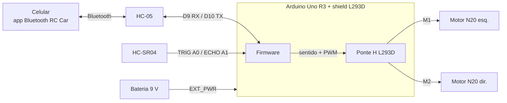

Tabela de ligações pino a pino, pinos reservados pelo shield e notas de alimentação:
**[hardware/conexoes.md](hardware/conexoes.md)**. O diagrama da arquitetura planejada (L298N) está em
[hardware/diagrama-componentes.png](hardware/diagrama-componentes.png).

### 7.3 Alimentação

Bateria 9 V no borne EXT_PWR do shield, jumper PWR instalado (o shield alimenta o Uno pelo Vin). O L293D
derruba ~1,5 V, então os motores recebem ~7,5 V. Com uma fonte menor (4 pilhas AA, 6 V) os motores ficariam
com ~4,5 V — insuficiente para vencer o atrito lateral das rodas livres nos giros no lugar.

### 7.4 Fotos da montagem

[img/componentes.jpg](img/componentes.jpg) · [img/chassi-interno.jpg](img/chassi-interno.jpg) · [img/carrinho-final.jpg](img/carrinho-final.jpg)

---

## 8. Software

### 8.1 Sketches

| Pasta | Uso | Estado |
|---|---|---|
| [`software/smars_completo/`](software/smars_completo/smars_completo.ino) | **Firmware final** — controle Bluetooth com segurança por sensor + modo autônomo, em um único upload | ✅ usar este |
| [`software/smars_bluetooth/`](software/smars_bluetooth/smars_bluetooth.ino) | Só controle Bluetooth (versão didática, sem sensor) | ✅ |
| [`software/smars_desvio/`](software/smars_desvio/smars_desvio.ino) | Só navegação autônoma (versão didática) | ✅ |
| [`software/historico/`](software/historico/) | Versões iniciais v1, com os problemas anotados no cabeçalho | histórico |

Compilação: Arduino IDE 2.x, placa **Arduino Uno**, biblioteca **Adafruit Motor Shield library (v1)**
(`AFMotor.h`). Os três sketches compilam sem avisos (≈ 6,4 kB de flash, 338 B de RAM no completo).

### 8.2 Como o programa funciona (`smars_completo`)

**Controle dos motores.** A biblioteca `AFMotor` comanda o shield: o sentido de cada canal passa por um
registrador 74HC595 e a velocidade pelos pinos PWM D11 (M1) e D3 (M2). A função `aplicar(velE, velD, dirE, dirD)`
centraliza tudo; `VEL_MAX_E/D` permitem compensar um motor mais forte para o carrinho andar reto. Curvas são
feitas por **tração diferencial**: giro no lugar (uma roda para frente, outra para trás) e diagonais com a roda
de dentro a 35 %.

**Comunicação sem fio.** O HC-05 conversa com o Uno por `SoftwareSerial` nos pinos D9/D10 a 9600 bps. O app
*Arduino Bluetooth RC Car* envia um caractere por botão:

| Caractere | Ação | | Caractere | Ação |
|---|---|---|---|---|
| `F` `B` | frente / ré | | `G` `I` | frente-esquerda / frente-direita |
| `L` `R` | gira esquerda / direita | | `H` `J` | ré-esquerda / ré-direita |
| `S` | parar (sai do autônomo) | | `0`–`9`, `q` | velocidade 10 %…100 % |
| `X` | **liga modo autônomo** | | `x` | desliga modo autônomo |

O último comando fica guardado e é reaplicado a cada volta do `loop()`, o que permite o bloqueio de segurança
descrito abaixo sem perder o comando do usuário.

**Sensor ultrassônico.** `lerCrua()` dispara o TRIG (10 µs) e mede o ECHO com `pulseIn` **com timeout de
25 ms** (sem eco = 400 cm, "livre" — a versão inicial devolvia 0 e o robô dava ré sem motivo). Um ping a
cada 60 ms e a **mediana das 3 últimas leituras** eliminam picos falsos sem travar o loop.

**Segurança (modo manual).** Se o último comando é de avanço (`F`, `G`, `I`) e a distância ≤ `DIST_PARAR`
(20 cm), os motores param; ré e giros continuam liberados. Quando o caminho libera, o avanço é retomado. Isso
implementa o requisito do MVP "obstáculo tem prioridade sobre o comando de avanço".

**Modo autônomo.** `passoAutonomo()` anda a `VEL_CRUZEIRO` e desacelera linearmente entre 45 e 20 cm. Ao
detectar obstáculo, `desviar()`: dá ré → **gira até o sensor ver ≥ 40 cm em 3 leituras seguidas** (+ margem)
→ segue. Se não abrir em 2,5 s: ré em arco para o outro lado e tenta o outro lado; se ainda não abrir:
meia-volta. Batidas seguidas mantêm o mesmo lado (a parede está do lado oposto); 3 desvios em 6 s = preso →
ré em arco longa e troca de lado. Girar "até ver livre" (em vez de girar por tempo fixo) foi a mudança que
resolveu o robô ficar oscilando frente-ré diante de paredes.

**Calibração.** Todas as constantes estão no topo do sketch: distâncias (`DIST_*`), velocidades (`VEL_*`),
tempos de manobra (`T_*`) e compensação por motor (`VEL_MAX_E/D`). O monitor serial (9600 bps) mostra o modo,
a distância e cada decisão de manobra.

### 8.3 Evolução do software

| Versão | Problema encontrado | Correção |
|---|---|---|
| v1 desvio ([historico](software/historico/v1_desvio_obstaculo.ino)) | `pulseIn` sem timeout → leituras 0 cm → ré aleatória; `int` estourava; reagia só a 7 cm; virava 500 ms às cegas | — |
| v2 desvio | filtro de mediana, reação a 20 cm, escaneio girando 45° para cada lado por tempo fixo | Ainda travava em paredes: quando o giro cronometrado ficava curto, media a mesma parede dos dois lados |
| **v3 desvio** ([smars_desvio](software/smars_desvio/smars_desvio.ino)) | — | Gira **até o sensor ver livre**, ré em arco, meia-volta, detecção de "preso", memória de lado |
| v1 Bluetooth ([historico](software/historico/v1_bluetooth.ino)) | `read()` sem `available()`; velocidade fixa; `J` tratado como parar | — |
| **v2 Bluetooth** ([smars_bluetooth](software/smars_bluetooth/smars_bluetooth.ino)) | — | slider de velocidade, diagonais, compensação por motor, 255 |
| **Unificado** ([smars_completo](software/smars_completo/smars_completo.ino)) | dois uploads diferentes para demonstrar sensor e Bluetooth | manual seguro + autônomo no mesmo firmware, alternado pelo app |

---

## 9. Testes e resultados

| # | Teste | Resultado | Problema / correção |
|---|---|---|---|
| 1 | Motores individuais (frente/ré) pelo shield | ✅ | — |
| 2 | Comandos Bluetooth F/B/L/R/S pelo app | ✅ | — |
| 3 | Locomoção com **esteiras** | ❌ | Laço curto: esteira pressionava as rodas e travava o motor. Tentativas: compensação de furos no fatiador +0,05 mm, elos esticados 1,4 %, lixa e lubrificação → **esteiras descartadas** |
| 4 | Rodas v1 lisas | ❌ | Rodam, mas PLA liso patina no piso |
| 5 | Rodas v2 ranhuradas (Ø32 = Ø32) | ❌ | Motoras giravam em falso: com diâmetros iguais perdiam o contato com o chão |
| 6 | Rodas v3 (motora Ø33 > livre Ø32) | 🔶 | Contato garantido; ainda faltava atrito em piso liso |
| 7 | Rodas v4 + elástico nas motoras | ✅ | **Tração resolvida**; carrinho anda e gira no lugar |
| 8 | Força dos motores | ✅ | Software já no máximo (`setSpeed(255)`); a força é definida pela tensão no shield (9 V) — ver [hardware/conexoes.md](hardware/conexoes.md) |
| 9 | Sensor: leituras com `pulseIn` sem timeout | ❌ | Valores 0 cm → ré aleatória. Corrigido com timeout + mediana |
| 10 | Desvio v2 diante de parede | ❌ | Oscilava frente-ré (giro cronometrado insuficiente) |
| 11 | Desvio v3 / firmware unificado | 🔄 | Gira até ver caminho livre; validação final registrada no vídeo |
| 12 | Bloqueio de avanço no modo manual | 🔄 | Obstáculo a < 20 cm para o carrinho; validação no vídeo |
| 13 | Autonomia da bateria | ⏳ | Não medida formalmente |

**Resultado final:** carrinho funcional, controlado pelo celular, com bloqueio de colisão e modo autônomo;
estrutura impressa em 3D com rodas redesenhadas pela equipe após o descarte das esteiras.

---

## 10. Evidências finais e instruções de uso

- **Foto do carrinho finalizado:** [img/carrinho-final.jpg](img/carrinho-final.jpg)
- **Vídeo (controle remoto, sensor e modo autônomo):** https://youtu.be/DnCW8VLloSI

### Como usar

1. Coloque a bateria 9 V no compartimento e conecte-a ao borne EXT_PWR do shield. O LED do HC-05 pisca rápido (aguardando pareamento).
2. No celular, pareie com o **HC-05** (PIN `1234` ou `0000`).
3. Abra o app **Arduino Bluetooth RC Car** (Android) → ícone de engrenagem → *Connect to car* → HC-05.
4. Setas: frente, ré, esquerda, direita e diagonais. Slider: velocidade. Ao soltar o botão o carrinho para.
5. Com um obstáculo a menos de 20 cm o avanço é bloqueado automaticamente; ré e giros continuam funcionando.
6. Botão extra **X** (ligado) → **modo autônomo**; **X** (desligado), qualquer seta ou *stop* → volta ao manual.
7. Para reprogramar: retire o jumper PWR do shield (ou a bateria), conecte o USB, grave `software/smars_completo` com a IDE Arduino (placa *Arduino Uno*, biblioteca *Adafruit Motor Shield library*).

Calibração recomendada no piso da demonstração: `VEL_MAX_E/D` (andar reto) e `T_MEIA_VOLTA_MS` (tempo de 180°).

---

## 11. Custos

| Componente | Qtd | Unitário | Total |
|---|---|---|---|
| Motor N20 500 rpm | 2 | R$ 20,40 | R$ 40,80 |
| Arduino Uno R3 | 1 | R$ 100,07 | R$ 100,07 |
| Módulo Bluetooth HC-05 | 1 | R$ 12,90 | R$ 12,90 |
| Shield ponte H L293D | 1 | R$ 11,90 | R$ 11,90 |
| Sensor HC-SR04 | 1 | R$ 15,00 | R$ 15,00 |
| Bateria 9 V | 1 | R$ 35,00 | R$ 35,00 |
| Cabos e jumpers | — | — | R$ 5,00 |
| Filamento PLA (~150 g) | — | — | R$ 10,00 |
| Elásticos | 2 | — | R$ 0,00 |
| **Total** | | | **R$ 230,67** |

---

## 12. Créditos e licença

- Chassi, suportes e capa do sensor: **SMARS** — Kevin Thomas, Thingiverse, licença Creative Commons (uso não comercial, atribuição).
- Rodas v1–v4, scripts de geração/validação, firmware e documentação: equipe do projeto.
- Biblioteca `AFMotor`: Adafruit Motor Shield library v1 (BSD).
- App de controle: *Arduino Bluetooth RC Car* (Android).
