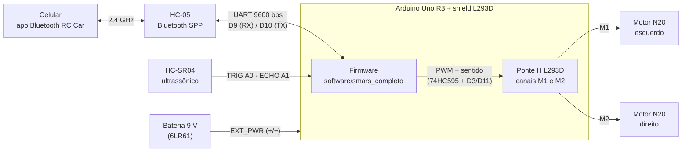

# Conexões elétricas — versão final

Arquitetura construída: Arduino Uno R3 + shield de motores L293D (empilhado no Uno) + 2 motores N20 +
HC-SR04 + HC-05 + bateria 9 V. O shield é a ponte H e também distribui a alimentação: a bateria entra no
borne **EXT_PWR** do shield e o Uno é alimentado pelo próprio shield (jumper PWR instalado).

> Esta é a arquitetura final. O planejamento inicial (`diagrama-componentes.*`, `img/diagrama-blocos.png`)
> previa ponte H L298N avulsa e bateria de 7,4 V; ver "Decisões de projeto" no README.

## Diagrama

## Tabela de ligações

| De | Para | Observação |
|---|---|---|
| Bateria 9 V (+) | Shield **EXT_PWR +** | Jumper **PWR** instalado: o shield alimenta o Uno pelo Vin |
| Bateria 9 V (−) | Shield **EXT_PWR −** (GND) | GND comum de todo o sistema |
| Motor N20 esquerdo | Shield borne **M1** | Inverter os dois fios se o motor girar ao contrário |
| Motor N20 direito | Shield borne **M2** | idem |
| HC-SR04 VCC | 5 V do shield | |
| HC-SR04 GND | GND | |
| HC-SR04 TRIG | **A0** | pinos analógicos usados como digitais (livres no shield) |
| HC-SR04 ECHO | **A1** | |
| HC-05 VCC | 5 V (pino central do conector de servo) | |
| HC-05 GND | GND (conector de servo) | |
| HC-05 TXD | **D9** (sinal do conector SERVO_2) | `SoftwareSerial bt(9, 10)` → RX do Arduino |
| HC-05 RXD | **D10** (sinal do conector SERVO_1) | TX do Arduino |

## Pinos consumidos pelo shield L293D (não usar para outra coisa)

| Pino | Função no shield |
|---|---|
| D3, D11 | PWM dos canais M2 e M1 |
| D4, D7, D8, D12 | registrador 74HC595 (sentido dos motores) |
| D5, D6 | PWM dos canais M3/M4 (não usados) |
| D9, D10 | conectores de servo — reaproveitados para o HC-05 |
| D0, D1 | serial USB (upload e monitor) |

Livres: **A0–A5** (por isso o HC-SR04 está em A0/A1) e D2, D13.

## Alimentação

- Tensão nos motores = 9 V − queda do L293D (~1,4 a 2 V) ≈ **7 a 7,5 V**. Os N20 usados são de 6 V;
  em uso intermitente e com carga leve funcionam bem nessa tensão.
- O Uno recebe 9 V no Vin pelo jumper PWR e regula para 5 V internamente.
- Nunca alimentar o shield pelo USB e pela bateria ao mesmo tempo com o jumper PWR instalado durante testes
  de motor: para programar com a bateria ligada, retire o jumper.

## Fotos da montagem

- `../img/componentes.jpg` — todos os componentes antes da montagem
- `../img/chassi-interno.jpg` — motores N20 nos berços, bateria 9 V central e cabos passando pelo chassi
- `../img/carrinho-final.jpg` — montagem final com shield empilhado e capa do sensor
